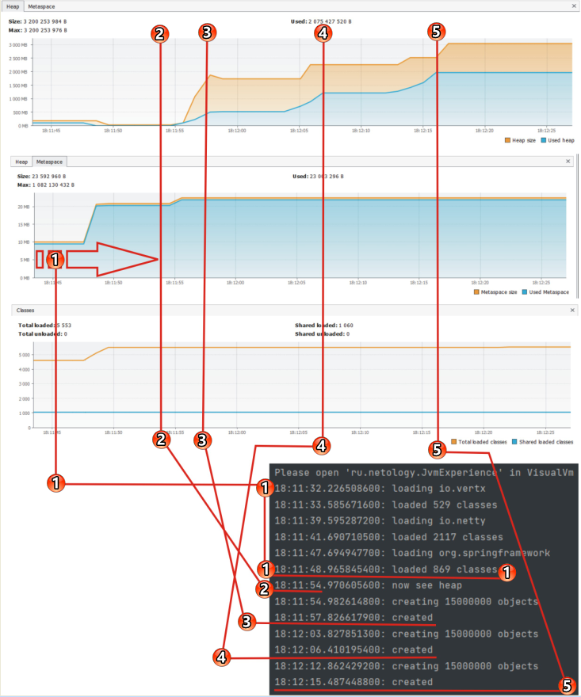

# Исследование JVM через VisualVM

### На темном фоне скрин консоли, закончившей работу анализируемой программы.

1. В начале выполнения, глядя на средний график отображающий загрузку области памяти Metaspase,
видно как загружаются многочисленные классы. На что потребовалось больше 20 Mb. При этом размер кучи (верхний график)
ничтожно мал.
2. С этого места начинает рости куча...
3. Программа создала 15 миллионов объектов. Известно что объекты JVM хранит в куче (верхний график). При этом наблюдается
рост потребления памяти до 500 Mb. Далее идет небольшая пауза при которой рост потребления памяти прекращается.
4. Далее программа создает еще 15 миллионов объектов. Бедная куча!). JVM видит стремительное уменьшение остатка кучи и оперативно
повышает ее предел, вслед за ростом объектов в памяти кучи. Объектами занято свыше 1 Gb!!! И опять небольшая пауза...
5. Далее все повторяется... еше 15 милионов объектов... Итого памяти в куче потрачено примерно 2Gb!!!

